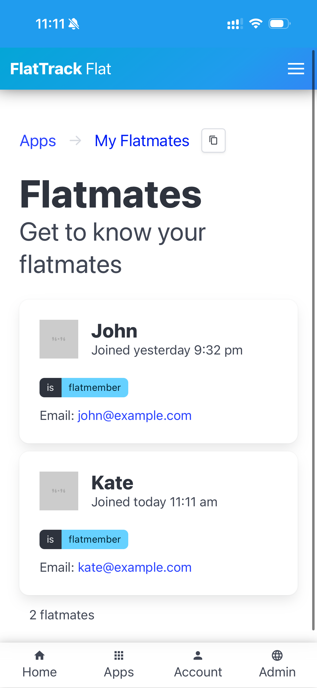

# FlatTrack

> Collaborate with your flatmates

 

(FlatTrack is current in alpha)

## Features

-   Shopping List
-   Flatmates

### Future

-   Tasks
-   Noticeboard
-   Shared Calendar
-   Recipes
-   Highfives

## Technologies

-   [golang](https://golang.org) - backend
-   [vuejs](https://vuejs.org) - frontend
-   [gorilla/mux](https://github.com/gorilla/mux) - HTTP multiplexer
-   [bulma](https://buefy.org) + [buefy](https://buefy.org) - CSS framework
-   [vuematerial](http://vuematerial.io) - CSS framework
-   [axios](https://github.com/axios/axios) - client-side HTTP request library
-   [ginkgo](https://onsi.github.io/ginkgo) & [gomega](https://onsi.github.io/ginkgo) - tests

## Getting started

Various options are available for running a FlatTrack instance:

-   [FlatTrack.io hosting](https://flattrack.io) (coming soon)
-   [Self-hosted Kubernetes](./docs/deployment-kubernetes.md) (recommended)
-   [Self-hosted Docker-Compose](./docs/deployment-docker-compose.md)

## Documentation

To view the documentation, please check out the GitLab-hosted [FlatTrack docs](https://flattrack.gitlab.io/flattrack)

## Contribution

### Development

From code, to assets/artwork, to community, to documentation, there are many ways to contribute.  
To learn how to contribute, please refer to the [development+contribution documentation](./docs/development.md).
Looking for something to do? Check out the [FlatTrack issues](https://gitlab.com/flattrack/flattrack/-/issues) page.

## Community

Join FlatTrack's community to chip in and improve it!
Please read:

-   [contributing docs](./docs/contributing.md).
-   [community docs](./docs/community.md).

## License

Copyright 2019-2023 Caleb Woodbine.
This project is licensed under the [AGPL-3.0](http://www.gnu.org/licenses/agpl-3.0.html) and is [Free Software](https://www.gnu.org/philosophy/free-sw.en.html).
This program comes with absolutely no warranty.

